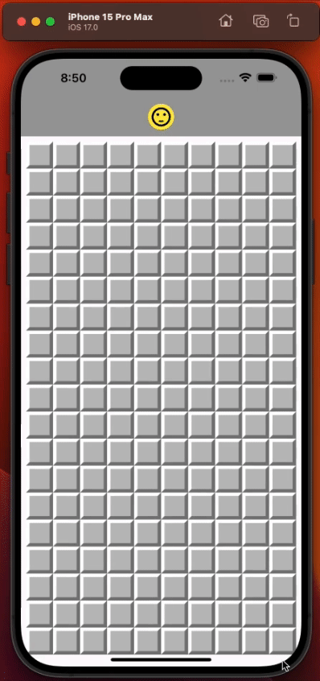
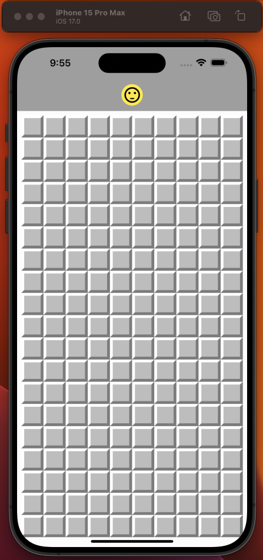
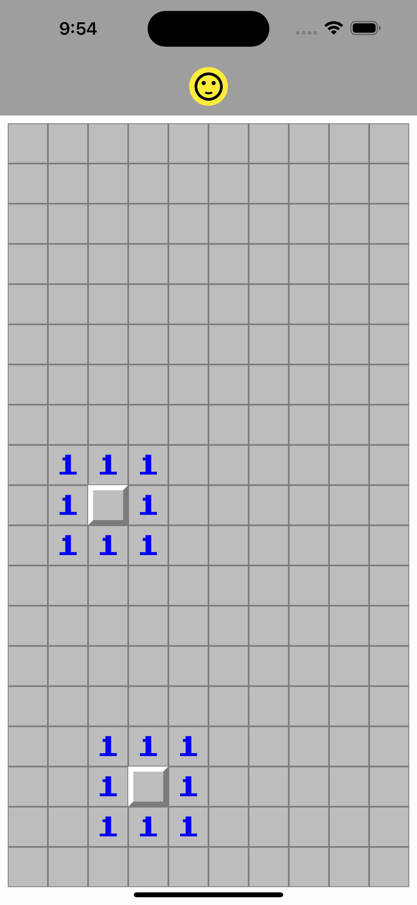
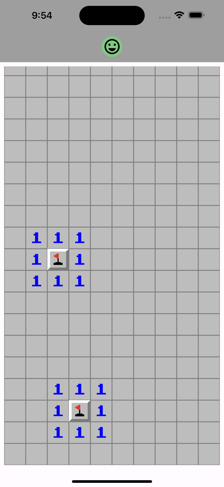
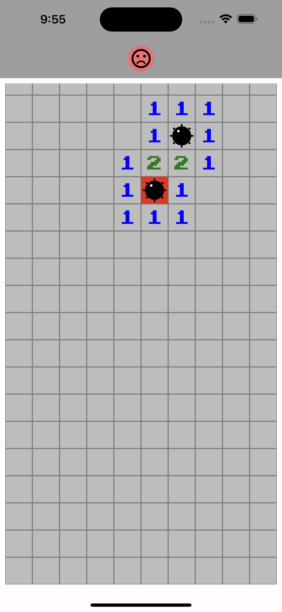

---

## Minefield Game App

---

<div align="center">

**Language:**

[](README.md)
[](README.pt-br.md)

</div>

---
## ℹ️ Sobre este repositório
Game mobile no estilo campo minado do windows 7.

O objetivo principal deste repositório é demonstrar o aplicativo desenvolvido para treinar meus conhecimentos durante o curso de Flutter da empresa [COD3R](https://www.udemy.com/course/curso-flutter/).

---
## ⚙️ Funcionalidades
Este app tem as seguintes funcionalidades dentro do game:

- Marcar campos com bandeiras caso tenha possíveis bombas (ao apertar e segurar um determinado campo).
- Abrir um determinado campo (com um toque simples).
- Verificar quantas bombas possuí ao redor de um campo aberto.
- Abrir varios campos vizinhos que não contém bombas.
- Exibir se o jogador ganhou ou perdeu o jogo com o emoji exibido no top-center da tela. 

---
## 👁️ Pré-visualização

<h1 align="center">


</h1>

<h1 align="center">


</h1>

<h1 align="center">


</h1>


---
## 🧪 Tecnologias
Este projeto foi desenvolvido usando as seguintes tecnologias:

- [Flutter 3.16.9](https://docs.flutter.dev/)
- [Dart 3.2.6](https://dart.dev/)

---
## ⚡ Instalação

Primeiramente clone este projeto usando:

```bash
  git clone https://github.com/GoedertDalmolin/minefield.git
  cd minefield
```

Por fim compile e execute o projeto.

---
</> Desenvolvido por [GoedertDalmolin](https://github.com/GoedertDalmolin) 👋
---
