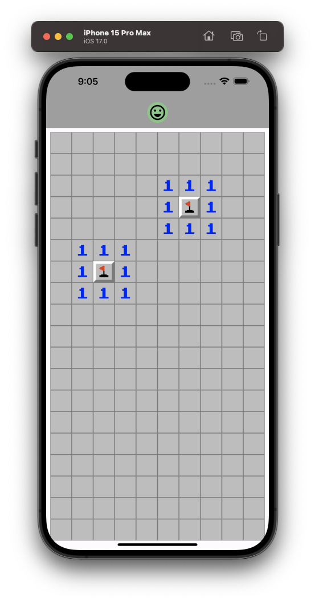

---

## Minefield Game App

---

<div align="center">

**Language:**

[](README.md)
[](README.pt-br.md)

</div>

---
## ℹ️ About this repository
Minesweeper-style mobile game for Windows 7.

This repository's main objective is to demonstrate the application developed to train my knowledge during the Flutter course from the company [COD3R](https://www.udemy.com/course/curso-flutter/).

---
## ⚙️ Features
This app has the following in-game features:

- Mark fields with flags if there are possible bombs (by pressing and holding a certain field).
- Open a specific field (with a single tap).
- Check how many bombs you have in an open field.
- Open several neighboring fields that do not contain bombs.
- Display whether the player won or lost the game with the emoji displayed in the top-center of the screen.

---
## 👁️ Preview

<h1 align="center">


</h1>

<h1 align="center">



</h1>


---
## 🧪 Technologies
This project was developed using the following technologies:

- [Flutter 3.16.9](https://docs.flutter.dev/)
- [Dart 3.2.6](https://dart.dev/)

---
## ⚡ Installing

Clone this project using:

```bash
  git clone https://github.com/GoedertDalmolin/minefield.git
  cd minefield
```

Finally compile and run the project.

---
</> Developed by [GoedertDalmolin](https://github.com/GoedertDalmolin) 👋
---
